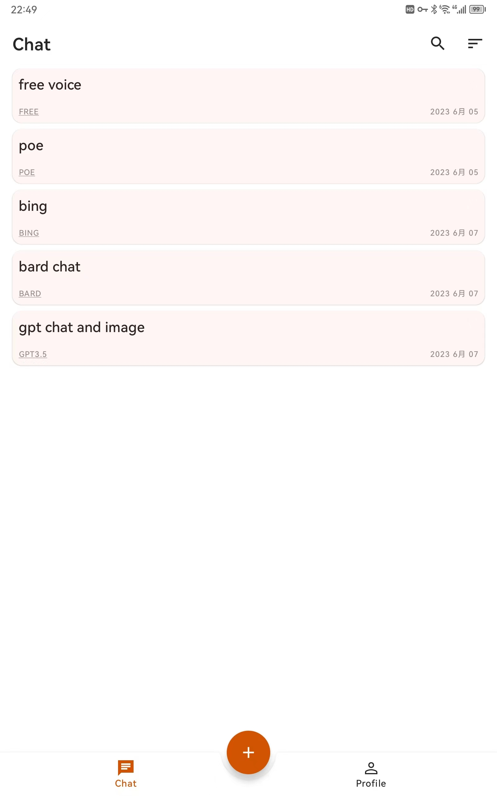

# moco-ai-client
あなたのハンディAIアシスタント

## 特徴
:white_check_mark: 回答を待つ必要がなく、連続してコマンドを送ることができます  
:white_check_mark: 会話履歴はローカルに保存され、あなたのプライバシーを守ります。チャットウィンドウにプライベートデータを送信しないでください！！  
:white_check_mark: ~~Microsoft New Bingのチャットと画像作成をサポートし、_U文字列だけで済みます。api-keyは必要ありません~~  
:white_check_mark: ~~Google Bardをサポートし、__Secure-1PSID文字列だけで済みます。api-keyは必要ありません~~  
:white_check_mark: ~~Poeをサポートし、m-b文字列だけで済みます。api-keyは必要ありません~~  
:white_check_mark: Google Geminiをサポートし、あなた自身のapi-keyが必要です  
:white_check_mark: ChatGPTのチャットと画像作成をサポートし、あなた自身のapi-keyが必要です  
:white_check_mark: GPT3.5をサポートし、開いてすぐに使えます。登録不要！:heart: :heart:  
:white_check_mark: 中国語と英語の連続音声入力をサポートし、60秒の制限を破ります  
:white_check_mark: MicrosoftのAI音声に接続し、中国語、英語、日本語、フランス語、ドイツ語、スペイン語、韓国語、タイ語のテキストから音声への変換をサポートします  

## スクリーンショット

| Chat     | Profile     | 
| :-------------: | :-------------: | 
|  |  | 
| Voice input     | TTS     | 
|  |  | 
| Share content     | Download image     | 
|  |  | 
| Dark theme     | Scan to Download Apk  | 
|  |  | 

# 注意
!! 交流・議論のみに使用し、違法目的に使用することは禁止されています。法的な結果が発生した場合は自己責任でお願いします！！

# 注意
!! 古いバージョンをインストールしている場合は、削除してから再インストールしてください！！

# 注意
1、~~sessionモードでは、Bing、Poe、BardのAIチャットがサポートされています~~  
2、api-keyモードでは、OpenAIチャットがサポートされています  
- [設定方法](https://github.com/zhayujie/bot-on-anything) sessionやapi-keyの取得方法はこちらを参照してください  

3、音声入力にはHuaweiの機械学習APIを使用しています  
4、すべての機密データはローカルにあり、他のサービスに接続していません    
5、開発中ですので、ご意見・ご要望がありましたら、issueを立ててください  

# TODO
1、UIの最適化  
2、~~画像生成を追加~~   

# 2025.02.25
1、Supports DeepSeek  

# 2024.06.24
1、Streaming output bug fix

# 2024.06.19
1、Devノード、Google Gemini、およびGPTのストリーミング出力をサポートする

# 2024.06.16
1、DEV node bug fix

# 2024.04.05
1、カスタムロールの設定を追加

# 2024.02.15
1、Add Gemini

# 2024.02.01
1、Bug fix

# 2024.01.31
1、Lepton追加

# 2024.01.20
1、無料3.5ノードを2つ追加（請求制限あり

# 2023.06.23
1、無料claudeノード追加

# 2023.06.19
1、テキストを選択し、サードパーティのアプリに共有する  
2、画像をアルバムにダウンロードでき、サードパーティのアプリに共有できる

# 2023.06.16
1、無効なFREEノードを交換。チャットウィンドウには機密データを送信しないでください、そうしないと、自己責任で後果を承担することになります

# 2023.06.10
1、PoeにGPT-4 bot追加

# 2023.06.09
1、Bardが中国語に対応

# 2023.06.08
1、TTSのバグ修正

# 2023.06.07
1、中国語・英語・日本語の3カ国語の朗読に対応

# 2023.06.05
1、Bingのテキストから音声への機能を追加

# 2023.06.03
1、公開されている無料ノード[aiassist](https://github.com/xtekky/gpt4free/tree/main/gpt4free/aiassist)を追加しました。一般的なネットワークで使用できます。チャットウィンドウには機密データを送信しないでください。そうしないと、自己責任で結果を負うことになります。

# 2023.06.01
1、画像生成を追加

# 2023.05.30
1、アルファ版をリリースしました