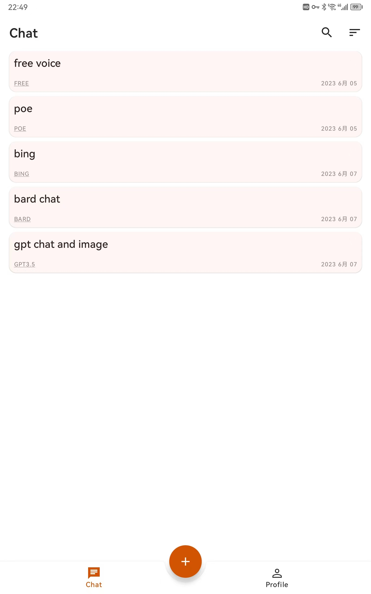
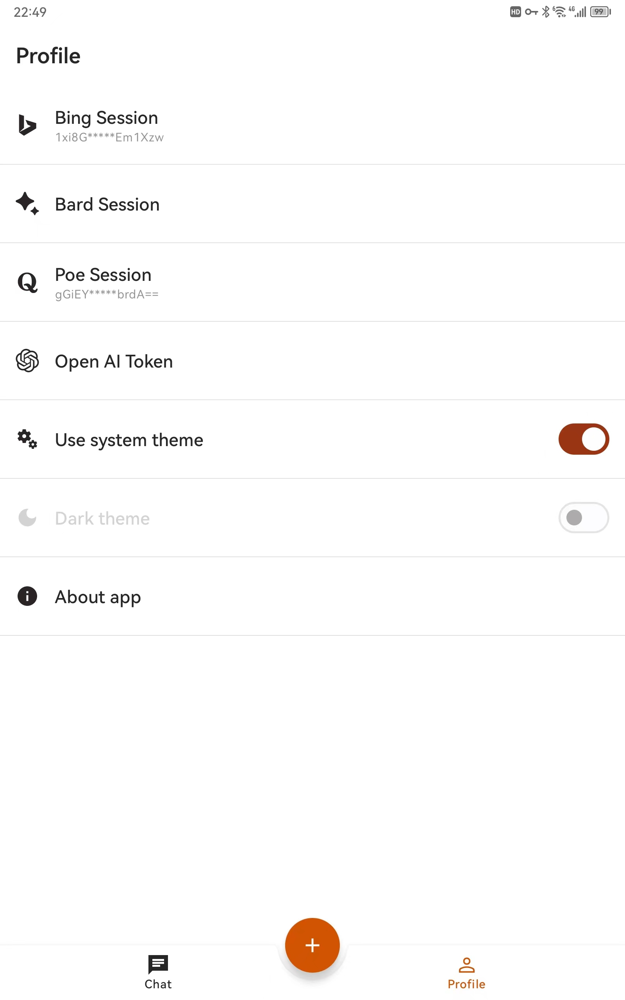
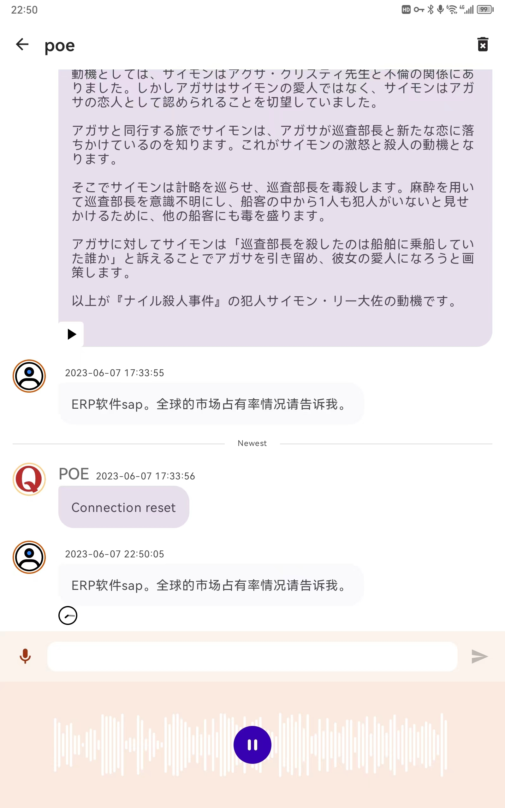
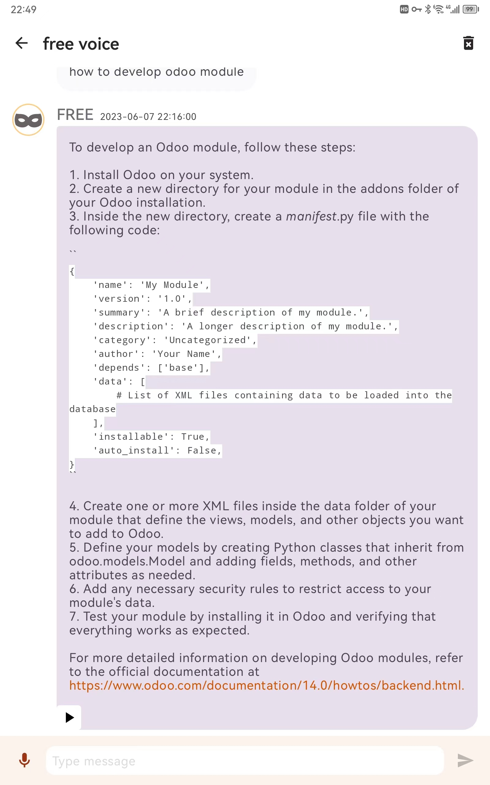
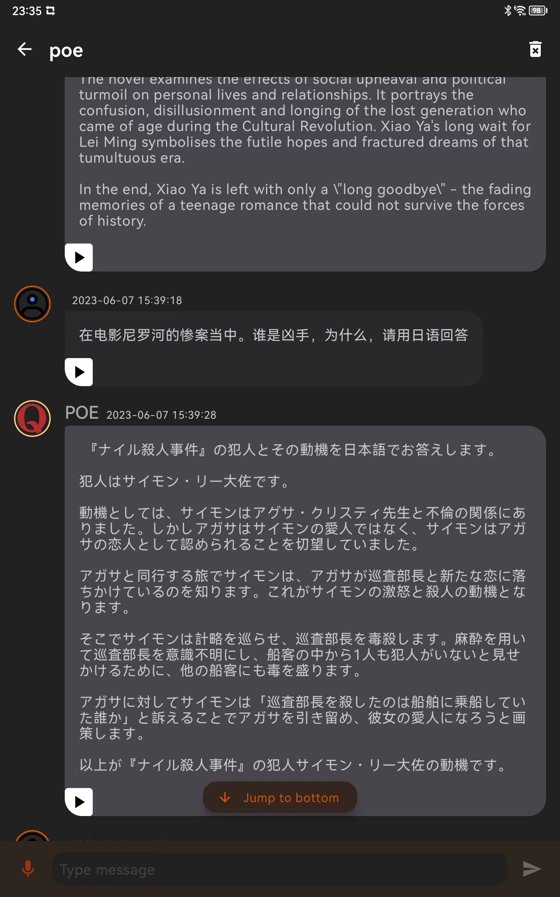

# moco-ai-client
Your AI handy assistant

## 特性
:white_check_mark:  不需要等待回答，可以连续发指令  
:white_check_mark:  对话历史保存在本地，保护你的隐私。注意聊天窗口不要提交隐私数据！！  
:white_check_mark:  支持微软New Bing聊天和图像创作，仅需_U字符串即可，不需要api-key  
:white_check_mark:  支持谷歌Bard，仅需__Secure-1PSID字符串，不需要api-key  
:white_check_mark:  支持Poe，仅需m-b字符串，不需要api-key  
:white_check_mark:  支持ChatGPT聊天和图像创作，需要你自己的api-key  
:white_check_mark:  支持国内网络环境用GPT3.5，打开即可使用，无需注册！:heart: :heart:  
:white_check_mark:  支持中英文连续语音输入，破除60s限制  
:white_check_mark:  对接微软的AI语音，支持中文、英文、日文、法语、德语、西班牙语、韩文、泰语的文字转语音  

## 截屏

| Chat     | Profile     | 
| :-------------: | :-------------: | 
|  |  | 
| Voice input     | TTS     | 
|  |  | 
| Dark theme     | Scan to Download Apk  | 
|  |  | 

# 注意
！！仅供交流探讨，禁止用于非法用途，有任何法律后果请自行承担！！

# 注意
！！如果有安装过旧版本，请先删除之后重新安装！！

# 注意
1、session模式，支持Bing、Poe、Bard的AI聊天  
2、api-key模式，支持OpenAI聊天  
- [配置说明](https://github.com/zhayujie/bot-on-anything) 获取session以及api-key参考这里  

3、直连各平台服务器，没有经过任何中转，因此需要你自己解决网络环境  
4、语音输入使用了华为的机器学习api  
5、所有敏感数据都在本地，没有连接其他服务    
6、开发中，有建议欢迎提issue  

# TODO
1、UI优化  
2、~~加入图片生成~~   

# 2023.06.09
1、Bard支持中文

# 2023.06.08
1、TTS bug fix

# 2023.06.07
1、支持中、英、日三国语言的朗读

# 2023.06.05
1、加入Bing的文字转语音功能

# 2023.06.03
1、加入公开的免费节点[aiassist](https://github.com/xtekky/gpt4free/tree/main/gpt4free/aiassist)，普通网络可用。聊天窗口请勿发送敏感数据，否则后果自负

# 2023.06.01
1、加入图片生成

# 2023.05.30
1、发布alpha版
