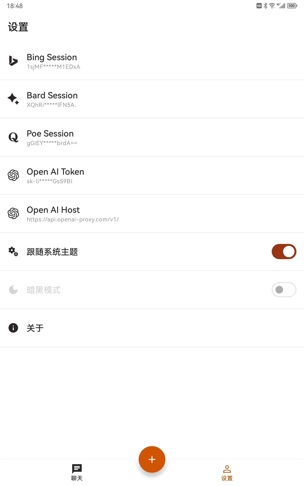
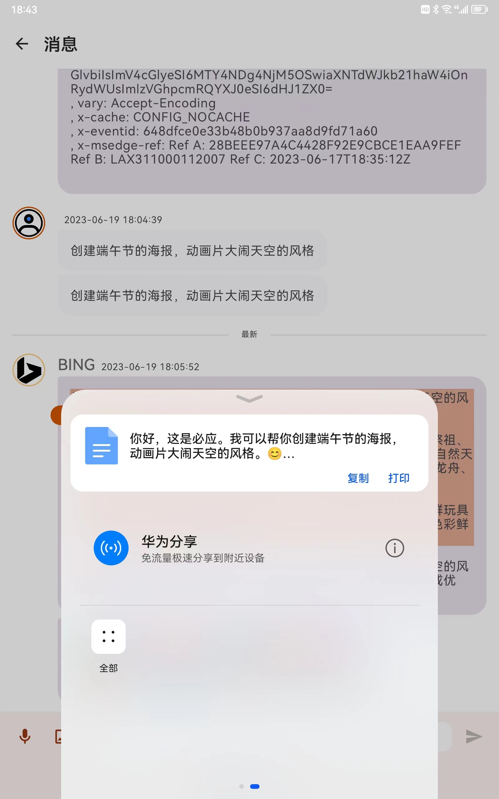

# moco-ai-client
Your handy AI assistant

## 特性
:white_check_mark:  不需要等待回答，可以连续发指令  
:white_check_mark:  对话历史保存在本地，保护你的隐私。注意聊天窗口不要提交隐私数据！！  
:white_check_mark:  ~~支持即梦和豆包图像创作，需要自己申请api-key~~  
:white_check_mark:  支持国内网络环境用Google Gemini，需要自己申请api-key  
:white_check_mark:  支持中英文连续语音输入，破除60s限制  
:white_check_mark:  对接微软的AI语音，支持中文、英文、日文、法语、德语、西班牙语、韩文、泰语的文字转语音  

## 截屏

| Chat     | Profile     | 
| :-------------: | :-------------: | 
|  |  | 
| Voice input     | TTS     | 
|  |  | 
| Share content     | Download image     | 
|  |  | 
| Dark theme     | Scan to Download Apk  | 
|  |  | 

# 注意
！！仅供交流探讨，禁止用于非法用途，有任何法律后果请自行承担！！

# 注意
！！如果有安装过旧版本，请先删除之后重新安装！！

# 注意
1、~~session模式，支持Bing、Poe、Bard的AI聊天~~  
2、api-key模式，支持OpenAI聊天  
- [配置说明](https://github.com/zhayujie/bot-on-anything) 获取session以及api-key参考这里  

3、语音输入使用了华为的机器学习api  
4、所有敏感数据都在本地，没有连接其他服务    
5、开发中，有建议欢迎提issue  

# TODO
1、UI优化  
2、~~加入图片生成~~  

# 2025.10.31
1、支持 即梦、豆包生图  

# 2025.02.25
1、支持 DeepSeek  

# 2024.06.24
1、Streaming output bug fix

# 2024.06.19
1、支持Dev节点、Google Gemini、GPT（包括自定义地址）的流式输出

# 2024.06.16
1、DEV node bug fix

# 2024.04.05
1、增加自定义角色设置

# 2024.02.15
1、增加 Gemini，需要自己申请API Key

# 2024.02.01
1、Bug fix

# 2024.01.31
1、增加Lepton，目前可用

# 2024.01.20
1、增加两个国内网络可用的3.5节点，线路受限，酌情使用

# 2023.06.23
1、增加一个国内网络可用的claude节点

# 2023.06.19
1、选中文字，分享到第三方App  
2、图片可下载到相册、可分享到第三方App

# 2023.06.16
1、替换无效的FREE节点，注意是第三方节点，聊天窗口请勿发送敏感数据，否则后果自负

# 2023.06.10
1、Poe加入GPT-4 bot

# 2023.06.09
1、Bard支持中文

# 2023.06.08
1、TTS bug fix

# 2023.06.07
1、支持中、英、日三国语言的朗读

# 2023.06.05
1、加入Bing的文字转语音功能

# 2023.06.03
1、加入公开的免费节点[aiassist](https://github.com/xtekky/gpt4free/tree/main/gpt4free/aiassist)，普通网络可用。聊天窗口请勿发送敏感数据，否则后果自负

# 2023.06.01
1、加入图片生成

# 2023.05.30
1、发布alpha版
